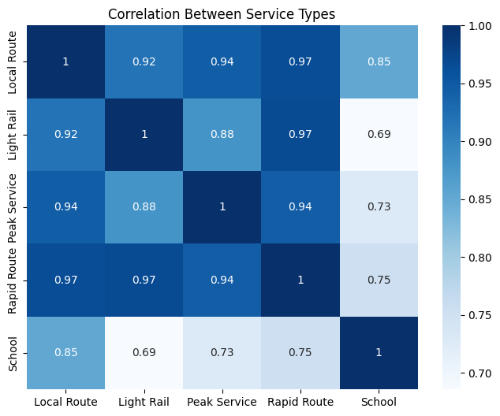
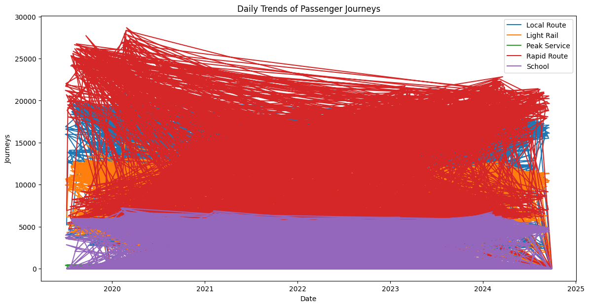
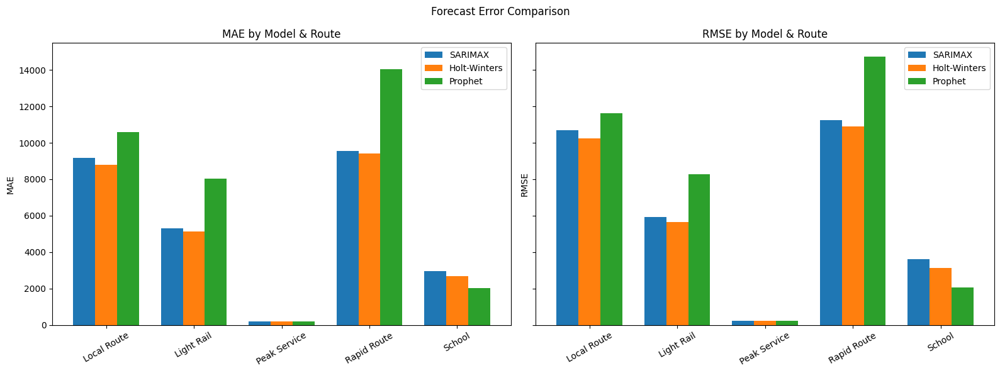

# Insights Report: Daily Public Transport Passenger Journeys

## Background

This report summarizes key patterns and actionable insights derived from 5 years of daily passenger journey data across all major public transport service types: Local Route, Light Rail, Peak Service, Rapid Route, and School.

## Key Insights

### 1. Strong Weekly Trends and Service Interdependence
- Major services (Local Route, Light Rail, Rapid Route, Peak Service) are strongly correlated, with passenger counts trending together.
- Busy weekday periods reflect commuter/work patterns; targeted increases in bus/train frequency are recommended on these days.

### 2. Sudden Demand Drop Linked to Calendar Events
- All forecast models (SARIMAX, Holt-Winters, Prophet) predict sharp reductions in demand during the latter half of the forecast period.
- This drop likely aligns with public holidays, school breaks, or major events. Operations teams should proactively adjust schedules and resources accordingly.

### 3. School Service Shows Distinct, Stable Behavior
- School journeys trend lower and vary independently from other services, reflecting academic calendar cycles.
- During forecasted low-demand days, school-specific resources (buses, drivers) can be reassigned to other high-demand routes.

### 4. Outliers Indicate Special Event Spikes
- 20 significant demand spikes detected per service, highlighting impact of festivals, city events, or disruptions.
- A calendar-aligned contingency plan—adding extra vehicles, extending service hours—will help manage these peak loads.

### 5. Which Model to Rely On?
- **Holt-Winters model** accurately predicts patterns for high-volume routes (Local, Light Rail, Rapid), and its forecasts best match recent historical performance.
- **Prophet model** is most robust for School and Peak Service, effectively managing low, variable demand and possible outliers.

## Visualizations

- **Correlation heatmap:** Shows dependencies between services.

*Figure 1: Service correlation matrix.*

- **Trend charts:** Visualize weekly and seasonal demand cycles.

*Figure 2: Daily passenger journey trends.*

- **Error metrics bar chart:** (See attached chart comparing SARIMAX/Holt/Prophet errors for each route.)

*Figure 3: RMSE errors for each model and route.*

*Figure 3: MAE errors for each model and route.*